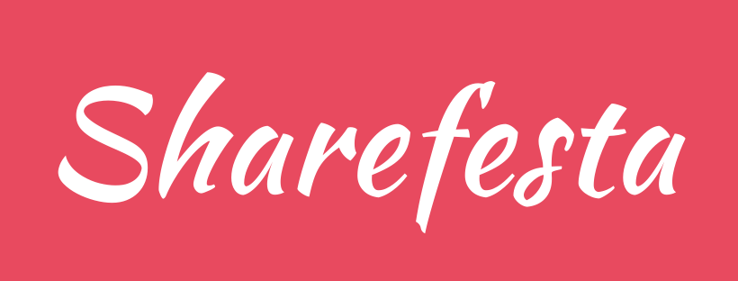

### Overview

Ever wonder what other people listen to in the music festival you attend? That's what Sharefesta can tell you. Sharefesta can check in your music festival and shows you the popular sounds among the attendees.

With Spotify login, we calculate Top 10 list of the most popular songs in your music festival. Not only that, you can tick those songs you like from the list and create a new playlist on your Spotify library.

You are not attending the festival today? You can check the popular songs in your city! With geo location bring provided by your phone, we find your city or your music festival you are attending.

###  How to run on your local machine

1. Run `bundle install`
2. Run `yarn install`
3. Run a server by `rails s`